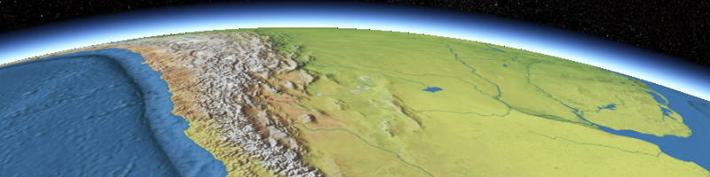

Graphics assets packaged for use with [Cesium](http://cesium.agi.com/).  These assets are an extension of the minimal graphics assets [included](https://github.com/AnalyticalGraphicsInc/cesium/tree/master/Source/Assets) with Cesium.

**Cesium version**: These assets are compatible with all versions since [b11](http://cesiumjs.org/downloads.html).

Each directory has a README.md that describes the assets in that directory and how to use them in Cesium with code examples.  Clone the repo and pick and choose what assets to deploy with your app.  Ask questions on the [Cesium forum](http://cesium.agi.com/forum.html).

Please credit the orginial datasets when required.  The README.md in each directory links to the terms of service.

Directories:

[imagery](imagery/)
-------

Tiled imagery for use on the Cesium globe.

[stars](stars/)
-----

Star cube map textures for use in Cesium.

[textures](textures/)
--------

Images generally useful as textures in Cesium.
